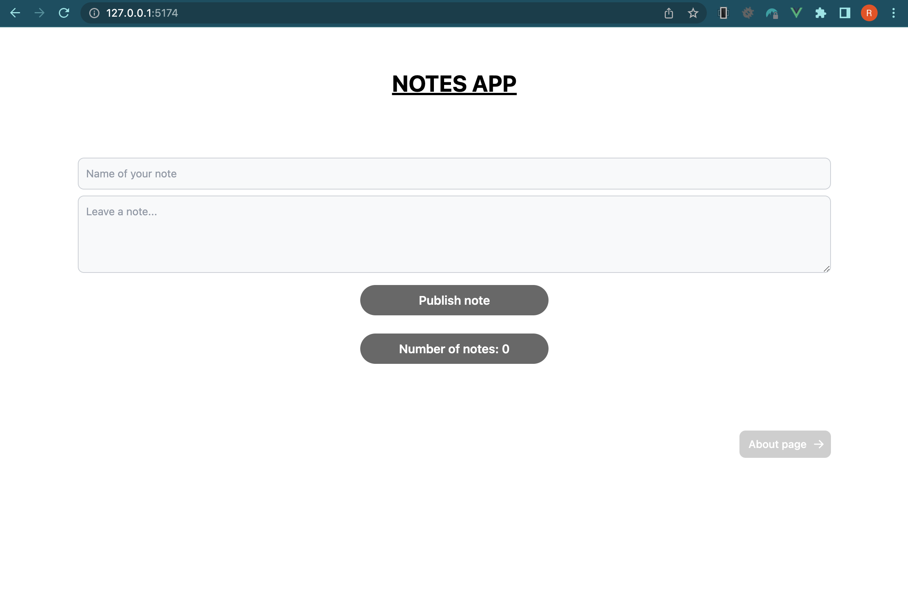

<h1 align="center">NOTES APP</h1>

## About NOTES APP

## NOTES-APP is a VUE application

### DETAILS

- ### LATEST VUE VERSION VUE@3
- ### PINIA STORE
  - #### PINIA is official replacement for VUEX
- ### VUE ROUTER
- ### TAILWINDCSS VERSION@3
- ### TYPESCRIPT VERSION@5

## HOME page
<p align="center"> </p>

## NOTES view
<p align="center"> </p>

## NOTE toggle (read/undo)
<p align="center"> </p>

## NOTE edit page
<p align="center"> </p>


## Project Setup

```sh
npm install
```

### Compile and Hot-Reload for Development

```sh
npm run dev
```

### Type-Check, Compile and Minify for Production

```sh
npm run build
```

### Lint with [ESLint](https://eslint.org/)

```sh
npm run lint
```
